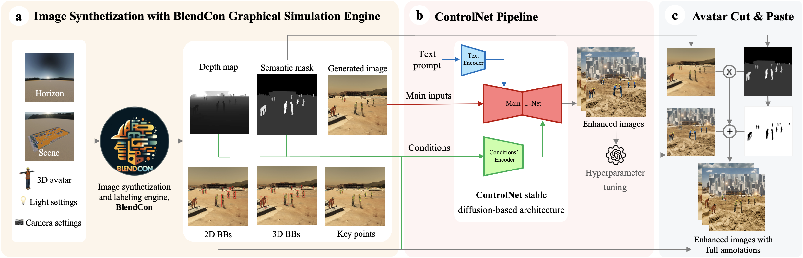
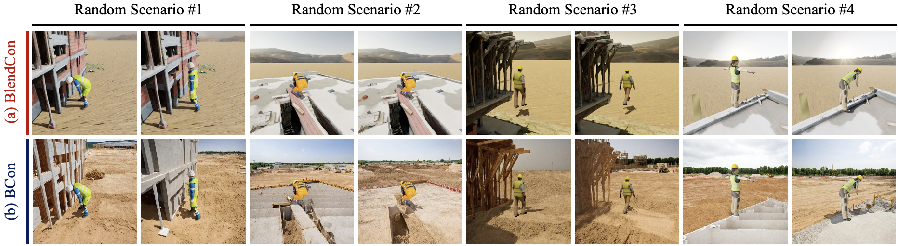

# BCon: ControlNet-Based Domain Adaptation of Synthetic Construction Images


BCon is a domain adaptation framework that enhances the realism and diversity of synthetic construction images using ControlNet with Stable Diffusion XL, while preserving full annotations essential for training deep neural networks (DNNs). This approach effectively bridges the domain gap inherent in synthetic data, reducing reliance on costly real-world data collection and annotation.

## Installation

1. **Clone the Repository**:
   ```sh
   git clone https://github.com/SinaDavari/bcon
   cd bcon

### Option 1: Using the Conda Environment YAML File
If you prefer to create the environment using the provided `environment.yaml` file, you can follow these steps:

2. **Create the Environment from the YAML File**:
   ```sh
   conda env create -f environment.yaml
   
3. **Activate the Environment**:
   ```sh
   conda activate bcon

### Option 2: Setting Up a New Environment

2. **Create a new Conda environment**:
   ```sh
   conda create --name bcon python=3.9.2
   
3. **Activate the environment**:

   ```sh
   conda activate bcon

4. **Install the dependencies:**
   ```sh
   pip install -r requirements.txt

## Usage
To run the BCon enhancement process:

1. **Set the Paths to Your Datasets**:

   * Update the dataset paths in `bcon.py` to point to your BlendCon images and annotations.
2. **Run the Script**:
   Process the images using BCon and output the enhanced images along with preserved annotations:
   ```sh
   python bcon.py

## Dataset
We provide sample datasets for testing and experimentation:

* Sample Enhanced Images: 100 random BCon-enhanced images along with their corresponding BlendCon images, depth maps, and semantic masks are available in the Datasets folder.

* Scraped Test Dataset (TorCon_Test): The scraped real-world test dataset used for evaluation is provided in the Datasets folder.

* Datasets folder structure is as follows:
   ```
   bcon/
   └── Datasets/
       ├── BlendCon_Samples/
       │   ├── depths/
       │   ├── imgs/
       │   ├── labels/
       │   └── masks/
       ├── BCon_Samples/
       └── TorCon_Test/
           ├── imgs/
           └── labels/
## Results
The object detection results, tested on the scraped test dataset, are summarized below:

<div align="center">
   
| Dataset            | # Images | # Instances | AP<sub>50–95</sub> (%) |
|--------------------|----------|-------------|------------------------|
| BlendCon           | 25,600   | 43,000      | 60.9                   |
| BCon               | 25,600   | 43,000      | 65.7                   |
| Real SODA + MOCS   | 12,800   | 43,000      | 65.6                   |

</div>

These results demonstrate the effectiveness of the BCon framework in improving object detection performance on synthetic data.



## Contributing
We welcome contributions from the community. If you'd like to contribute, please follow these steps:

1. Fork the repository.
2. Create a new branch for your feature or bugfix.
3. Commit your changes with clear messages.
4. Submit a pull request describing your changes.

## Citation
If you use this code or dataset in your research, please cite our paper:
```bibtex
@article{BCon2025,
  title={BCon: ControlNet-Based Domain Adaptation of Synthetic Construction Images},
  author={Sina Davari, Daeho Kim, and Ali Tohidifar},
  journal={TBA},
  year={2025}
}
